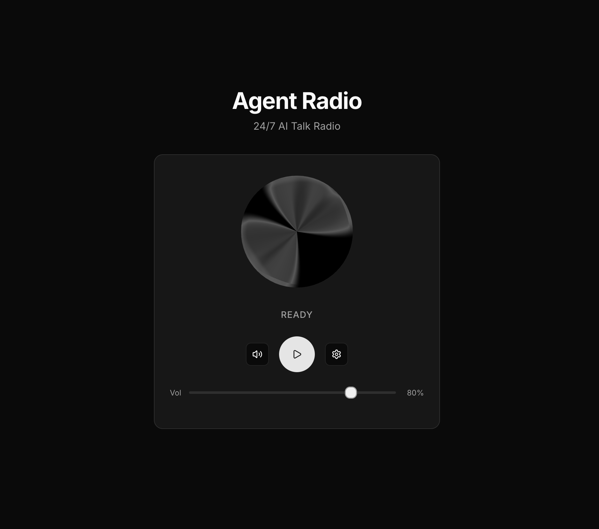

# Agent Radio

24/7 AI-powered talk radio. Configure your radio's personality and let it talk forever.

> **Note:** This project is still in active development. Use with caution.

Inspired by [elevenlabs/ui](https://github.com/elevenlabs/ui).



## How It Works

```
┌─────────────────────────────────────────────────────────┐
│                    Infinite Loop                        │
│                                                         │
│   1. Generate script (Gemini API)                       │
│   2. Convert to speech (ElevenLabs API)                 │
│   3. Add to audio queue                                 │
│   4. Play from queue                                    │
│   5. Repeat forever                                     │
└─────────────────────────────────────────────────────────┘
```

## Setup

1. Clone the repo:
   ```bash
   git clone https://github.com/YOUR_USERNAME/agentradio.git
   cd agentradio
   ```

2. Install dependencies:
   ```bash
   pnpm install
   ```

3. Copy `.env.example` to `.env.local`:
   ```bash
   cp .env.example .env.local
   ```

4. Add your API keys to `.env.local`:
   - `GOOGLE_API_KEY` - Get from [aistudio.google.com](https://aistudio.google.com/apikey)
   - `ELEVENLABS_API_KEY` - Get from [elevenlabs.io](https://elevenlabs.io)

5. Run the dev server:
   ```bash
   pnpm dev
   ```

6. Open [http://localhost:3000](http://localhost:3000)

## Configuration

Click the settings icon to customize:

- **Voice ID**: Enter any ElevenLabs voice ID
- **Instructions**: Describe what your radio should talk about

### Example Instructions

**Late Night Philosophy:**
```
You are a late-night philosophical radio host. Discuss consciousness,
existence, and meaning in a calm, thoughtful tone.
```

**Tech News:**
```
You are a tech news commentator. Discuss recent trends in AI, startups,
and technology with enthusiasm and insight.
```

**Storyteller:**
```
You are a storyteller sharing short tales and fables. Each segment
is a complete micro-story with a beginning, middle, and end.
```

## Tech Stack

- Next.js 16 (App Router)
- Google Gemini API (content generation)
- ElevenLabs API (text-to-speech with Eleven v3)
- React Three Fiber (Orb visualizer)
- Tailwind CSS

## License

MIT
